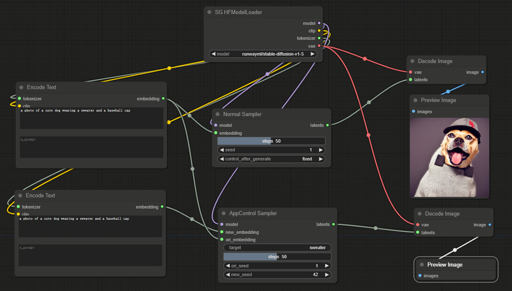

# ComfyUI nodes to use selfguidance

可以帮助锁定prompt中的特定对象在二次编辑中不被改变，对两次推理的crossattention map进行loss guidance。

https://github.com/lindapu-1/my_layout_guidance/tree/main
https://dave.ml/selfguidance/

## Install

- 推荐使用管理器 ComfyUI Manager 安装（On the Way）

- 手动安装：
    1. `cd custom_nodes`
    2. `git clone https://github.com/leeguandong/ComfyUI_SelfGuidance.git`
    3. 重启 ComfyUI

## Use

- 节点：
  - SG HFModelLoader: 加载hf格式的模型权重
  - Encode Text: 编辑prompt文件
  - Normal Sampler: 常规推理
  - DecodeImage: VAE解码图片
  - AppControlSampler: 控制侧推理

## Stars 

